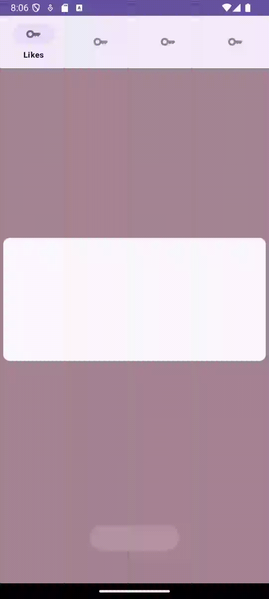

<em> NiceStart </em>
<h1>Descipción del proyecto</h1>
    
Nicestart es una aplicacion centrada en el inicio de sesión del usuario

<h1>Funcionalidades</h1>
    
Al iniciar la aplicacion aparece un pantalla de carga con el nombre de la aplicacion y el logo

    
Los atributos y el fondo cuentan con animaciones, ademas de contar con una animacion lottie

    
    
La aplicacion cuenta con la pantalla de inicio de sesion, desde la que se puede acceder a la pantalla de inicio de sesion o a la pantalla principal

    
    
La pantalla de login tambien cuenta con un modo osucro y un modo landscape

    
    
    
Tambien cuenta con otra pantalla de registro, que permite volver a la pantalla de inicio de sesion o acceder a la pantalla principal

    
    
La pantalla de signup tambien cuenta con un modo osucro y un modo landscape

    
    
    
La pantalla principal cuenta con una imagen de fondo y una barra superior, que contiene el acceso a un mensaje emergente o a la pantalla del perfil

    
    
En esta ultima pantalla se encuentra el perfil del usuario, donde se encuentran las redes sociales del usuario y una breve descripción de si mismo

    
    
Se ha añadido tambien un menu, en el que es posible desplazarse de forma lateral entre pantallas

    
    
Y por último, se ha añadido un menu inferior que cuenta con un botón flotante

    
    
Toda la aplicacion esta en español y traducida al ingles

    
