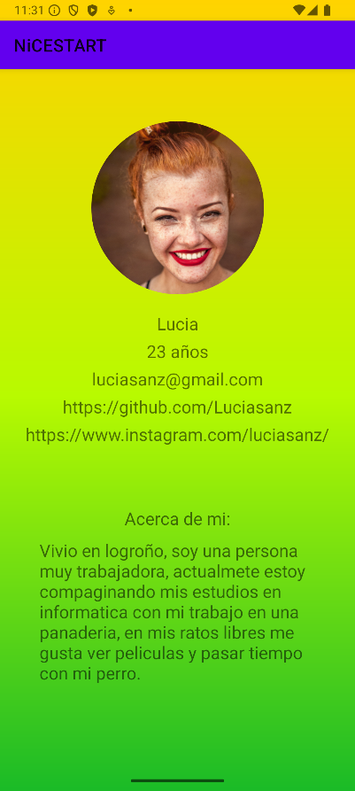

<em> NiceStar </em>
<h1>Descipción del proyecto</h1>
    
Nicestart es una aplicacion centrada en el inicio de sesión del usuario

<h1>Funcionalidades</h1>
    
Al iniciar la aplicacion aparece un pantalla de carga con el nombre de la aplicacion y el logo

    
Los atributos y el fondo cuentan con animaciones

    
    
La aplicacion cuenta con la pantalla inicial de inicio de sesion.

    
    
Tambien cuenta con otra pantalla de registro.

    
    
Y por último la pantalla principal a la que se accede tras pasar por una de las dos anteriores

    
En esta pantalla se encuentra el perfil del usuario, donde se encuentran las redes sociales del usuario y una breve descripción de si mismo

    
